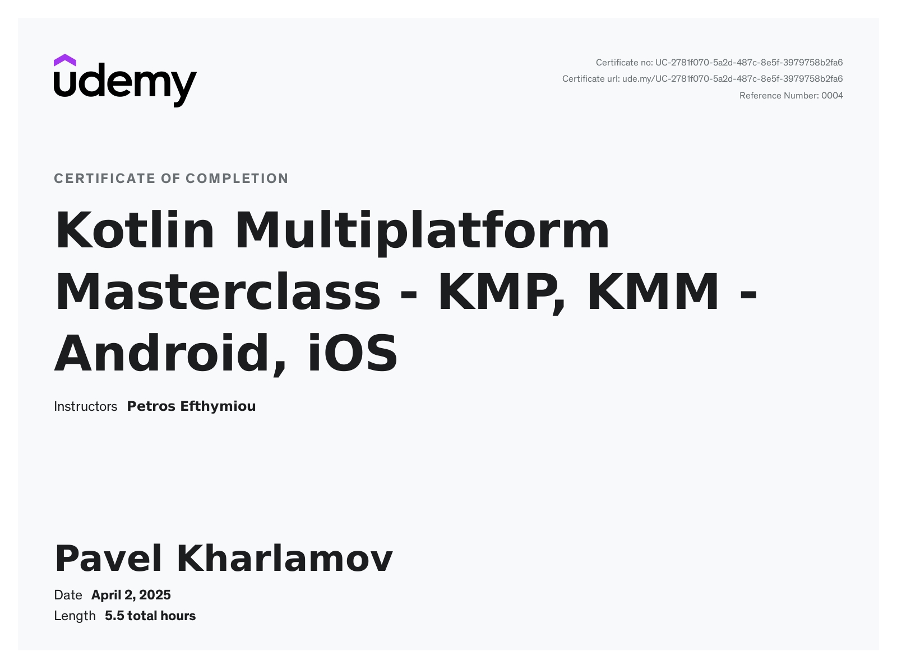

# 📰 Daily Pulse — News Aggregator App (Kotlin Multiplatform)

A cross-platform news aggregation app built with **Kotlin Multiplatform (KMP/KMM)**, sharing core logic between Android and iOS.

---

## 📱 Platform Support

- ✅ Android (Jetpack Compose)
- ✅ iOS (SwiftUI)
- ✅ Shared business logic (Ktor, SQLDelight)

---

## 🎥 Demo

### Android  


### iOS  


---

## 🛠 Tech Stack

- Kotlin Multiplatform Mobile (KMM)
- Ktor Client for networking
- SQLDelight for local data storage
- Koin for dependency injection
- MVI + Clean architecture
- Jetpack Compose (Android UI)
- SwiftUI (iOS UI)

---

## 📦 Artifacts

- 📱 [Download Android APK](https://github.com/PavelKharlamov/daily-pulse-kmm-course/releases/download/v1.0.0/DailyPulse_Android.apk)
- 🍏 [Download .zip archive with .app (iOS Simulator)](https://github.com/PavelKharlamov/daily-pulse-kmm-course/releases/download/v1.0.0/DailyPulse_iOS_Simulator.zip)

> ⚠️ The `.app` file is built for iOS Simulator only and cannot be run on physical devices.

---

## 🏅 Certification



Completed:  
**Kotlin Multiplatform Masterclass — KMP, KMM - Android, iOS**  
Instructor: Petros Efthymiou  
Date: April 2, 2025
📘 [View course on Udemy](https://www.udemy.com/course/kotlin-multiplatform-masterclass/?couponCode=ST15MT20425G1)

---

## 🧰 Development Environment

- 💻 MacBook Pro M1  
- macOS Sonoma 14.7  
- Xcode 16.0 (16A242d)  
- Android Studio Ladybug | 2024.2.1  
- Kotlin: 1.9.10  
- Jetpack Compose: 1.5.1  
- Swift: 6.0  
- SwiftUI: 6.0 (Xcode 16.0)  

---

## ⚙️ Run Locally

### Android

```bash
./gradlew :androidApp:assembleDebug
adb install androidApp/build/outputs/apk/debug/androidApp-debug.apk
```

### iOS

```bash
# Open the iOS project in Xcode
open iosApp/iosApp.xcodeproj
# Select a Simulator and press ⌘R
```

---

## 🙋‍♂️ Author

**Pavel Kharlamov**  
🔗 GitHub: [@PavelKharlamov](https://github.com/PavelKharlamov)

---

## 📄 License

MIT License — feel free to use and contribute!